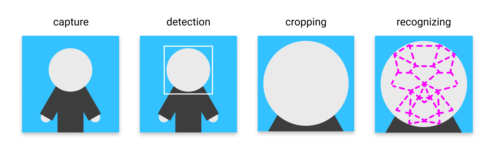
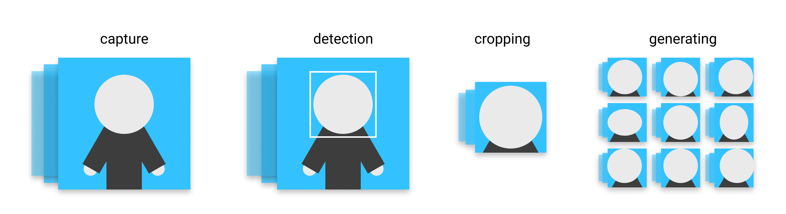

  
  
#  Exam Project 2020 | Face Recognizer
  
By **Pernille Lørup & Stephan Djurhuus**  
Institute **CPHBusiness**  
  
Education **Software Development**  
Elective **Artificial Intelligence**  
  
[Link to GitHub Repository](https://github.com/BA-Software-Development-Ed/ai-exam-project )
  
###  Objective
  
The objective of this task is to enable you to demonstrate the knowledge of artificial intelligence and machine learning acquired during the elective AI course.  
The task is to create a machine learning based solution to a real life problem.
  
Full exam details can be found in [exam-task.md](exam-task.md ).
  
###  Prerequisite
  
**[Anaconda Environment](https://anaconda.org/ )**
  
additional python packages
```bash
Flask           1.1.2       # pip install Flask 
tensorflow      2.1.0       # pip install tensorflow
opencv-python   4.2.0.34    # pip install opencv-python
```
  
###  Execution
  
To start the flask application run the following script and go to http://localhost:5000/.
  
**Run Server**
_bash_
```bash
python src/app.py
```
  
###  Notebooks
  
The notebooks is located here [src/notebooks](src/notebooks ).
  
___
##  The Content
  
  
- [The Theory](#the-theory )
  - [Introduction](#introduction )
  - [Face Detection](#face-detection )
    - [Cascade Classification](#cascade-classification )
      - [Classifier Validations](#classifier-validations )
  - [Data Processing](#data-processing )
  - [Face Recognition](#face-recognition )
  - [Artificial Neural Network (ANN)](#artificial-neural-network-ann )
    - [Layers](#layers )
    - [Activation Functions](#activation-functions )
    - [Model Validations](#model-validations )
  - [Convolutional Neural Network (CNN)](#convolutional-neural-network-cnn )
    - [Layers](#layers-1 )
    - [Activation Functions](#activation-functions-1 )
    - [Model Validations](#model-validations-1 )
  - [Conclusion](#conclusion )
- [The Source](#the-source )
  - [Project Structure](#project-structure )
  
___
##  The Theory
  
  
###  Introduction
  
We decided to create a face recognition application, using `TensorFlow`, `openCV` and `Flask` as the main components. 
  
  

  
_some info about the project..._
  
###  Face Detection
  
  
####  Cascade Classification
  
  
We are using a _Haar feature-based cascade classifier_ from `openCV`, to detect faces bounding boxes on the images. The reason for this is to isolate the face as much possible to optimize the recognizer model.
  
Haar feature-based cascade classifiers are pretrained classifiers made for a specific purpose, in our case detecting faces on images. Like many other intelligent agents it has been trough a supervised learning with great amount of images with and without faces. The features in the classifier is similar to the convolutional kernel in a CNN model.
  
#####  Classifier Validations
  
  

  
**haarcascade_frontalcatface_alt**  
_validation here..._
  
**haarcascade_frontalcatface_alt2**  
_validation here..._
  
**haarcascade_frontalcatface_default**  
_validation here..._
  
[reference, docs.opencv.org](https://docs.opencv.org/master/db/d28/tutorial_cascade_classifier.html )
[resource, github.com/opencv](https://github.com/opencv/opencv/tree/master/data/haarcascades )
  
###  Data Processing
  
  

  
[ImageDataGenerator, tensorflow.org](https://www.tensorflow.org/api_docs/python/tf/keras/preprocessing/image/ImageDataGenerator )
  
_about data generator here..._
  
###  Face Recognition
  
  
###  Artificial Neural Network (ANN)
  
_about ann here..._
  
####  Layers
  
  
**Flatten**
_about layer here..._
  
**Dense Layer**
_about layer here..._
  
####  Activation Functions
  
_about activation functions here..._
  
####  Model Validations
  
_model configurations and data here..._
  
###  Convolutional Neural Network (CNN)
  
_about cnn here..._
  
####  Layers
  
**Convolutional Layer**
_about layer here... (kernels)_
  
**Max Pooling Layer**
_about layer here... (kernels)_
  
####  Activation Functions
  
_about activation functions here..._
  
####  Model Validations
  
_model configurations and data here..._
  
###  Conclusion
  
_conclusion here..._
___
##  The Source
  
  
###  Project Structure
  
  
```bash
# jupyter notebooks for demonstration
/notebooks
├─ FaceDetector.ipynb             # face detection
├─ FaceRecognizer.ipynb           # cnn face recognition
└─ ArtificialNeuralNetwork.ipynb  # ann face recognition
  
# flask files
app.py      # main file
/templates   # html templates
/static      # javascript, styling and assets
/storage     # stored images from webcams
  
# custom classes for flask application
FaceDetector.py     # notebook as class
FaceRecognizer.py   # notebook as class
Utilities.py        # classes for encoding, plotting ect.
  
# models and classifiers
/cascade-classifiers   # facial cascade classifiers
/models                # saved tensorflow models
  
# image collections
/data # dataset from microsoft
```
  
  