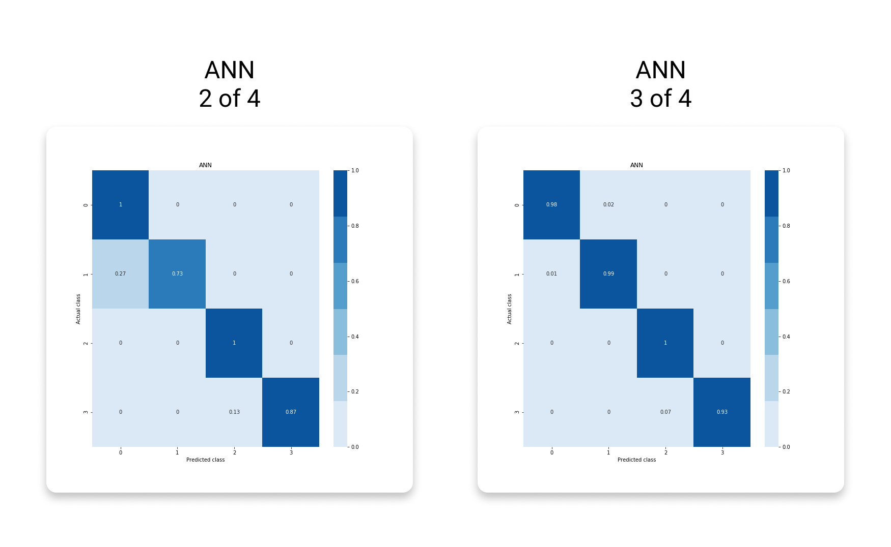

  
  
#  Exam Project 2020 | Face Recognizer
  
By **Pernille Lørup & Stephan Djurhuus**  
Institute **CPHBusiness**  
  
Education **Software Development**  
Elective **Artificial Intelligence**  
  
[Link to GitHub Repository](https://github.com/BA-Software-Development-Ed/ai-exam-project )
  
###  Objective
  
The objective of this task is to enable you to demonstrate the knowledge of artificial intelligence and machine learning acquired during the elective AI course.  
The task is to create a machine learning based solution to a real life problem.
  
Full exam details can be found in [exam-task.md](exam-task.md ).
  
###  Prerequisite
  
**[Anaconda Environment](https://anaconda.org/ )**
  
additional python packages
```bash
Flask           1.1.2       # pip install Flask 
tensorflow      2.1.0       # pip install tensorflow
opencv-python   4.2.0.34    # pip install opencv-python
```
  
###  Execution
  
To start the flask application run the following script and go to http://localhost:5000/.
  
**Run Server**  
_bash_
```bash
python src/App.py
```
  
###  Notebooks
  
The notebooks is located here [src/notebooks](src/notebooks ).
  
___
##  The Content
  
  
- [The Theory](#the-theory )
  - [Introduction](#introduction )
  - [Face Detection](#face-detection )
    - [Cascade Classification](#cascade-classification )
      - [Classifier Validations](#classifier-validations )
  - [Data Processing & Augmentation](#data-processing-augmentation )
  - [General Neural Network](#general-neural-network )
    - [Adam Optimizer](#adam-optimizer )
  - [Artificial Neural Network (ANN)](#artificial-neural-network-ann )
    - [Layers](#layers )
    - [Model Validations](#model-validations )
  - [Convolutional Neural Network (CNN)](#convolutional-neural-network-cnn )
    - [Layers](#layers-1 )
    - [Model Validations](#model-validations-1 )
  - [Conclusion](#conclusion )
- [The Source](#the-source )
  - [Project Structure](#project-structure )
  - [FaceDetector (.py)](#facedetector-py )
  - [FaceRecognizer (.py)](#facerecognizer-py )
  - [DataGenerator (.py)](#datagenerator-py )
  - [Utilities (.py)](#utilities-py )
  - [App (.py)](#app-py )
  - [models (directory)](#models-directory )
  
___
##  The Theory
  
  
###  Introduction
  
We decided to create a face recognition application, using `TensorFlow`, `openCV` and `Flask` as the main components. 
  
The models are based on each family member in `Family1` from the [datasets](src/data/PersonGroup )
  

  
The core functionality of the system is to isolate faces in images and make a recognition based on the highest predicted label.
  
The project also includes a web application to interact with the model as a client. This application uses the best of our models to detect and recognize the faces in the posted images.  
  
###  Face Detection
  
  
####  Cascade Classification
  
  
We are using a _Haar feature-based cascade classifier_ from `openCV`, to detect faces bounding boxes on the images. The reason for this is to isolate the face as much possible to optimize the recognizer model.
  
Haar feature-based cascade classifiers are pretrained classifiers made for a specific purpose, in our case detecting faces on images. Like many other intelligent agents it has been trough a supervised learning with great amount of images with and without faces. The features in the classifier is similar to the convolutional kernel in a CNN model.
  
#####  Classifier Validations
  
  

  
**haarcascade_frontalcatface_alt**  
_validation here..._
  
**haarcascade_frontalcatface_alt2**  
_validation here..._
  
**haarcascade_frontalcatface_default**  
_validation here..._
  
[reference, docs.opencv.org](https://docs.opencv.org/master/db/d28/tutorial_cascade_classifier.html )
[resource, github.com/opencv](https://github.com/opencv/opencv/tree/master/data/haarcascades )
  
###  Data Processing & Augmentation
  
  

  
We are using our custom class [FaceDetector.py](src/FaceDetector.py ) to crop the face from each image. 
  
Subsequently we are using the custom class [DataGenerator.py](src/DataGenerator.py ) to generate augmented images. This class uses `ImageDataGenerator` from Tensor Flow, to manipulate images with given arguments.
  
  
```python
ImageDataGenerator(
    rotation_range=20,
    width_shift_range=0.1,
    height_shift_range=0.1,
    shear_range=10,
    horizontal_flip=True,
    fill_mode='reflect',  # constant, nearest, reflect, wrap
)
```
  
As the last step of our data processing we split the dataset into training and testing datasets.
  
[ImageDataGenerator, tensorflow.org](https://www.tensorflow.org/api_docs/python/tf/keras/preprocessing/image/ImageDataGenerator )
  
###  General Neural Network
  
  
####  Adam Optimizer
  
The `Adam` optimizer is the recommended optimizer for general purposes because the default configuration parameters work well with most problems. The optimizer is a gradient decent method and creates good and fast results.
  
###  Artificial Neural Network (ANN)
  
An Artificial Neural Network is a collection of connected nodes/neurons which can pass a value from one neuron to another. It consists of three types of layers; input, hidden and output. These layer connections forms the network architecture. 
  
####  Layers
  
  
**Flatten**  
Flatten layer takes an  dimensional array and makes it one dimensional and are easier for the model to process. 
  
**Dense Layer**  
This layer creates a vector of  neurons that uses the output from the previous layer. 
  
####  Model Validations
  
  


  
_ann 2 of 4_
```
_________________________________________________________________
Layer (type)                 Output Shape              Param #   
=================================================================
flatten_1 (Flatten)          (None, 10000)             0         
_________________________________________________________________
dense_2 (Dense)              (None, 500)               5000500   
_________________________________________________________________
dense_3 (Dense)              (None, 250)               125250    
_________________________________________________________________
dense_4 (Dense)              (None, 4)                 1004      
=================================================================
Total params: 5,126,754
Trainable params: 5,126,754
Non-trainable params: 0
_________________________________________________________________
```
  
_ann 3 of 4_
```
_________________________________________________________________
Layer (type)                 Output Shape              Param #   
=================================================================
flatten_6 (Flatten)          (None, 10000)             0         
_________________________________________________________________
dense_17 (Dense)             (None, 500)               5000500   
_________________________________________________________________
dense_18 (Dense)             (None, 250)               125250    
_________________________________________________________________
dense_19 (Dense)             (None, 4)                 1004      
=================================================================
Total params: 5,126,754
Trainable params: 5,126,754
Non-trainable params: 0
_________________________________________________________________
```
  
###  Convolutional Neural Network (CNN)
  
A Convolutional Neural Network is a type of ANN but has one or more layers consisting of convolutional units. 
  
A convolutional layer creates n outputs generated by the kernels. Kernels add all the field's pixel values with the coefficient from the pixel's location in the kernel. These outputs are new images based on the input, but assigned with the results of the kernels.
  

  
####  Layers
  
  
**Max Pooling Layer**  
A Max Pooling layer creates an output generated by the kernels. Kernels takes the highest pixel value from the pixels located in the kernel. This creates a new image based on the input, but assigned with the results of the kernel.
  
**Dropout (Regularization)**
The Dropout layer excludes a random  percentage of the dataset for each epoch. This reduces the case of over-fitting, but can cause under-fitting if the dropout is too high.
  
####  Model Validations
  
_model configurations and data here..._
  


  
_cnn 2 of 4_
```
_________________________________________________________________
Layer (type)                 Output Shape              Param #   
=================================================================
conv2d (Conv2D)              (None, 98, 98, 25)        700       
_________________________________________________________________
dropout (Dropout)            (None, 98, 98, 25)        0         
_________________________________________________________________
max_pooling2d (MaxPooling2D) (None, 49, 49, 25)        0         
_________________________________________________________________
conv2d_1 (Conv2D)            (None, 47, 47, 50)        11300     
_________________________________________________________________
max_pooling2d_1 (MaxPooling2 (None, 23, 23, 50)        0         
_________________________________________________________________
conv2d_2 (Conv2D)            (None, 21, 21, 50)        22550     
_________________________________________________________________
max_pooling2d_2 (MaxPooling2 (None, 10, 10, 50)        0         
_________________________________________________________________
conv2d_3 (Conv2D)            (None, 8, 8, 50)          22550     
_________________________________________________________________
flatten (Flatten)            (None, 3200)              0         
_________________________________________________________________
dense (Dense)                (None, 50)                160050    
_________________________________________________________________
dense_1 (Dense)              (None, 4)                 204       
=================================================================
Total params: 217,354
Trainable params: 217,354
Non-trainable params: 0
_________________________________________________________________
```
  
_cnn 3 of 4_
```
_________________________________________________________________
Layer (type)                 Output Shape              Param #   
=================================================================
conv2d_26 (Conv2D)           (None, 98, 98, 25)        700       
_________________________________________________________________
dropout_9 (Dropout)          (None, 98, 98, 25)        0         
_________________________________________________________________
max_pooling2d_17 (MaxPooling (None, 49, 49, 25)        0         
_________________________________________________________________
conv2d_27 (Conv2D)           (None, 47, 47, 50)        11300     
_________________________________________________________________
max_pooling2d_18 (MaxPooling (None, 23, 23, 50)        0         
_________________________________________________________________
conv2d_28 (Conv2D)           (None, 21, 21, 50)        22550     
_________________________________________________________________
flatten_12 (Flatten)         (None, 22050)             0         
_________________________________________________________________
dense_27 (Dense)             (None, 50)                1102550   
_________________________________________________________________
dense_28 (Dense)             (None, 4)                 204       
=================================================================
Total params: 1,137,304
Trainable params: 1,137,304
Non-trainable params: 0
_________________________________________________________________
```
  
|            | ANN 2 of 4 | ANN 3 of 4 | CNN 2 of 4 | CNN 3 of 4 |
|------------|------------|------------|------------|------------|
| 1          |  Flatten    | Flatten    | Conv2D     | Conv2D     |
| 2          |  Dense      | Dense      | Dropout 0.2| Dropout 0.2|
| 3          |  Dense      | Dense      | MaxPooling | MaxPooling |
| 4          |  Dense 4    | Dense 4    | Conv2D     | Conv2D     |
| 5          |             |            | MaxPooling | MaxPooling |
| 6          |             |            | Conv2D     | Conv2D     | 
| 7          |             |            | Flatten    | Flatten    |
| 8          |             |            | Dense      | Dense      |
| 9          |             |            | Dense 4    | Dense 4    |
| Accuracy   |             |            |            |            |
  
###  Conclusion
  
_conclusion here..._
  
with these analysis we found that the kids looks more like their mother than their father.
  
  

___
##  The Source
  
  
###  Project Structure
  
  
```bash
# jupyter notebooks for demonstration
/notebooks
├─ FaceDetector.ipynb     # face detection
└─ FaceRecognizer.ipynb   # face recognition
  
# flask files
App.py       # main file
/templates   # html templates
/static      # javascript, styling and assets
  
# custom classes for flask application
FaceDetector.py     # notebook as class
FaceRecognizer.py   # notebook as class
DataGenerator.py    # notebook as class
Utilities.py        # classes for encoding, plotting ect.
  
# models and classifiers
/cascade-classifiers   # facial cascade classifiers
/models                # saved tensorflow models
  
# image collections
/data # dataset from microsoft
```
  
###  FaceDetector (.py)
  
[FaceDetector.py](src/FaceDetectorpp.py )
  
The class contains methods to crop, resize, mark and get face details and uses the _Haar feature-based cascade classifier_ to detect faces in images. 
  
###  FaceRecognizer (.py)
  
[FaceRecognizer.py](src/FaceRecognizer.py )
  
The class contains methods to train and test the model, save and load models, get model summary and recognize faces from previous detections.
  
###  DataGenerator (.py)
  
[DataGenerator.py](src/DataGenerator.py )
  
The class contains methods to generate augmented datasets from cropped images, merge and shuffle datasets.
  
###  Utilities (.py)
  
[Utilities.py](src/Utilities.py )
  
This module contains a `Base64` class that contains methods to decode base64 images.
This module also contains a `Displayer` class that contains methods to plot images, confusion matrix, accuracy history and mark detections with predictions.
  
###  App (.py)
  
[FaceDetector.py](src/App.py )
  
This is the flask server main file, containing the routes and endpoints for the web application.
  
###  models (directory)
  
This directory contains the pretrained models with their corresponding accuracy history.
  
The models are saved in this format: `TYPE_model_Xof4.h5`  
The history are saved in this format: `TYPE_model_Xof4_hist.csv`
  