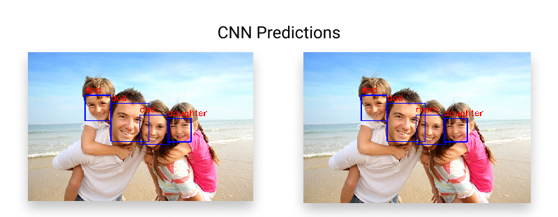
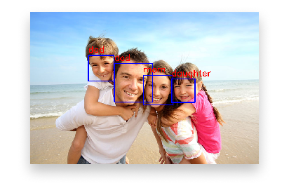

---
export_on_save:
  markdown: true
markdown:
  path: README.md
  ignore_from_front_matter: true
---

# Exam Project 2020 | Face Recognizer {ignore=true}
By **Pernille Lørup & Stephan Djurhuus**  
Institute **CPHBusiness**  

Education **Software Development**  
Elective **Artificial Intelligence**  

[Link to GitHub Repository](https://github.com/BA-Software-Development-Ed/ai-exam-project)

### Objective {ignore=true}
The objective of this task is to enable you to demonstrate the knowledge of artificial intelligence and machine learning acquired during the elective AI course.  
The task is to create a machine learning based solution to a real life problem.

Full exam details can be found in [exam-task.md](exam-task.md).

### Prerequisite {ignore=true}
**[Anaconda Environment](https://anaconda.org/)**

additional python packages
```bash
Flask           1.1.2       # pip install Flask 
tensorflow      2.1.0       # pip install tensorflow
opencv-python   4.2.0.34    # pip install opencv-python
```

### Execution {ignore=true}
To start the flask application run the following script and go to http://localhost:5000/.

**Run Server**  
_bash_
```bash
python src/App.py
```

### Notebooks {ignore=true}
The notebooks is located here [src/notebooks](src/notebooks).

___
## The Content {ignore=true}
[TOC]

___
## The Theory

### Introduction
We decided to create a face recognition application, using `TensorFlow`, `openCV` and `Flask` as the main components. 

The models are based on each family member in `Family1` from the [datasets](src/data/PersonGroup)


The core functionality of the system is to isolate faces in images and make a recognition based on the highest predicted label.

The project also includes a web application to interact with the model as a client. This application uses the best of our models to detect and recognize the faces in the posted images.  

### Face Detection

#### Cascade Classification

We are using a _Haar feature-based cascade classifier_ from `openCV`, to detect faces bounding boxes on the images. The reason for this is to isolate the face as much possible to optimize the recognizer model.

Haar feature-based cascade classifiers are pretrained classifiers made for a specific purpose, in our case detecting faces on images. Like many other intelligent agents it has been trough a supervised learning with great amount of images with and without faces. The features in the classifier is similar to the convolutional kernel in a CNN model.

##### Classifier Validations


**haarcascade_frontalcatface_alt**  
As seen in the images above, the first classifier `haarcascade_frontalcatface_alt` detects three out of four faces which is insufficient for our purpose.

**haarcascade_frontalcatface_alt2**  
This classifier successfully detected all four faces in the image which is shown above. This classifier is therefore the best choice for our application. 

**haarcascade_frontalcatface_default**  
The last classifier over-detected the amounts of "faces". This resulted in an insufficient functionality because of the augmentation being loaded with invalid images.

[reference, docs.opencv.org](https://docs.opencv.org/master/db/d28/tutorial_cascade_classifier.html)  
[resource, github.com/opencv](https://github.com/opencv/opencv/tree/master/data/haarcascades)

### Data Processing & Augmentation


We are using our custom class [FaceDetector.py](src/FaceDetector.py) to crop the face from each image. 

Subsequently we are using the custom class [DataGenerator.py](src/DataGenerator.py) to generate augmented images. This class uses `ImageDataGenerator` from Tensor Flow, to manipulate images with given arguments.


```python
ImageDataGenerator(
    rotation_range=20,
    width_shift_range=0.1,
    height_shift_range=0.1,
    shear_range=10,
    horizontal_flip=True,
    fill_mode='reflect',  # constant, nearest, reflect, wrap
)
```

As the last step of our data processing we split the dataset into training and testing datasets.

[ImageDataGenerator, tensorflow.org](https://www.tensorflow.org/api_docs/python/tf/keras/preprocessing/image/ImageDataGenerator)

### General Neural Network

#### Adam Optimizer
The `Adam` optimizer is the recommended optimizer for general purposes because the default configuration parameters work well with most problems. The optimizer is a gradient decent method and creates good and fast results.

### Artificial Neural Network (ANN)
An Artificial Neural Network is a collection of connected nodes/neurons which can pass a value from one neuron to another. It consists of three types of layers; input, hidden and output. These layer connections forms the network architecture. 

#### Layers

**Flatten**  
Flatten layer takes an $n$ dimensional array and makes it one dimensional and are easier for the model to process. 

**Dense Layer**  
This layer creates a vector of $n$ neurons that uses the output from the previous layer. 

#### Model Validations

We ended up with two Artificial Neural Network models. We based the validation from these models on the amount of correct recognized faces. This resulted in a model with an accuracy of `2:4` and `3:4` even though the test validation accuracy was about 95%. As seen on the confusion matrixes below the actual validation accuracy was close to perfect, but in the practical test the accuracy wasn't as good. This is the reason we defined the accuracy by the amount of recognized faces instead of the actual value.


These are the results we based our accuracy on. The first image shows an accurate recognition of `2:4` where the image on the right shows an accurate recognition of `3:4`.


### Convolutional Neural Network (CNN)
A Convolutional Neural Network is a type of ANN but has one or more layers consisting of convolutional units. 

A convolutional layer creates n outputs generated by the kernels. Kernels add all the field's pixel values with the coefficient from the pixel's location in the kernel. These outputs are new images based on the input, but assigned with the results of the kernels.


#### Layers

**Max Pooling Layer**  
A Max Pooling layer creates an output generated by the kernels. Kernels takes the highest pixel value from the pixels located in the kernel. This creates a new image based on the input, but assigned with the results of the kernel.

**Dropout (Regularization)**  
The Dropout layer excludes a random $n$ percentage of the dataset for each epoch. This reduces the case of over-fitting, but can cause under-fitting if the dropout is too high.

#### Model Validations

We ended up with two Convolutional Neural Network models. We based the validation from these models on the amount of correct recognized faces. This resulted in a model with an accuracy of `2:4` and `3:4` even though the test validation accuracy was 77% and 99%. As seen on the confusion matrixes below the actual validation accuracy was close to perfect on the last model, but in the practical test the accuracy wasn't as good. This is the reason we defined the accuracy by the amount of recognized faces instead of the actual value.


These are the results we based our accuracy on. The first image shows an accurate recognition of `2:4` where the image on the right shows an accurate recognition of `3:4`.



### Conclusion
We have experienced that `ReLU` was the only activation function that worked for our application. We tried using `Sigmoid`, `SoftMax` and `TanH` but these functions resulted in an insufficient accuracy.

We ended up with two models with the accuracy of `3:4`. The first model was an `ANN` and the second was a `CNN`. We selected the `CNN` because of its natur to analyse images and find patterns by convolving. Even though the `ANN` was good, it could only predict from a single channel image, which would reduce the accuracy for larger classes.

The table below shows the different architectures of the models. This data comes from the models we selected to save, however the `Activation` functions and `Kernel` sizes was not saved as we thought they would. This is the reason why the columns seems similar.

|            | ANN 2 of 4 | ANN 3 of 4 | CNN 2 of 4  | CNN 3 of 4  |
|------------|------------|------------|-------------|-------------|
| 1          | Flatten    | Flatten    | Conv2D 25   | Conv2D 25   |
| 2          | Dense 500  | Dense 500  | Dropout 0.2 | Dropout 0.2 |
| 3          | Dense 250  | Dense 250  | MaxPooling  | MaxPooling  |
| 4          | Dense 4    | Dense 4    | Conv2D 50   | Conv2D 50   |
| 5          |            |            | MaxPooling  | MaxPooling  |
| 6          |            |            | Conv2D 50   | Conv2D 50   | 
| 7          |            |            | Flatten     | Flatten     |
| 8          |            |            | Dense 50    | Dense 50    |
| 9          |            |            | Dense 4     | Dense 4     |
| Dataset    | $150\times3\times4$ | $150\times3\times4$ | $300\times3\times4$ | $300\times3\times4$ |
| Epochs     | 15         | 10         | 5           | 5           |
| Accuracy   | 93.33%     | 99.50%     | 77.67%      | 93.33%      |

These values can be found in [Model Architectures](model-architectures.md)

The model we ended up selecting was the Convolutional model with the accuracy of `3:4`. This was the model we implemented in our web application. Because we couldn't implement an `Unknown` class, uploading other images than [identification 1](src/data/identification1.jpg) would only give invalid predictions.



_With these analysis we found that the son looks a lot like his father._

#### Optimization
The recognition models would be more useful if we implemented an `Unknown` class to them. This class could be based on a threshold on the probability of a recognition. We could for instance say every detection with a probability below 70% would be defined as the `Unknown` class.

The data augmentation is a great tool to generate similar images, but a real large dataset would give a more accurate prediction. The possibility to use augmentation on these images would still be possible.

We started with a concept of creating a profile from a collection of images which would be trained by our model and result in a model that could recognize you. This wasn't implemented in our application due to the fact that we didn't have the knowledge to create the functionality supporting it.
___
## The Source

### Project Structure

```bash
# jupyter notebooks for demonstration
/notebooks
├─ FaceDetector.ipynb     # face detection
└─ FaceRecognizer.ipynb   # face recognition

# flask files
App.py       # main file
/templates   # html templates
/static      # javascript, styling and assets

# custom classes for flask application
FaceDetector.py     # notebook as class
FaceRecognizer.py   # notebook as class
DataGenerator.py    # notebook as class
Utilities.py        # classes for encoding, plotting ect.

# models and classifiers
/cascade-classifiers   # facial cascade classifiers
/models                # saved tensorflow models

# image collections
/data # dataset from microsoft
```

### FaceDetector (.py)
[FaceDetector.py](src/FaceDetectorpp.py)

The class contains methods to crop, resize, mark and get face details and uses the _Haar feature-based cascade classifier_ to detect faces in images. 

### FaceRecognizer (.py)
[FaceRecognizer.py](src/FaceRecognizer.py)

The class contains methods to train and test the model, save and load models, get model summary and recognize faces from previous detections.

### DataGenerator (.py)
[DataGenerator.py](src/DataGenerator.py)

The class contains methods to generate augmented datasets from cropped images, merge and shuffle datasets.

### Utilities (.py)
[Utilities.py](src/Utilities.py)

This module contains a `Base64` class that contains methods to decode base64 images.
This module also contains a `Displayer` class that contains methods to plot images, confusion matrix, accuracy history and mark detections with predictions.

### App (.py)
[FaceDetector.py](src/App.py)

This is the flask server main file, containing the routes and endpoints for the web application.

### models (directory)
This directory contains the pretrained models with their corresponding accuracy history.

The models are saved in this format: `TYPE_model_Xof4.h5`  
The history are saved in this format: `TYPE_model_Xof4_hist.csv`